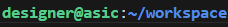

Welcome to Open Source ASIC Design!

# Getting Started
Follow the [Docker Installation](https://github.com/Cal-Poly-Open-Source-ASIC-Class) instructions to make sure docker is installed. If you are on Windows, you should be using WSL for all of this.

## Github Setup
Within WSL/Mac, configure your username and email for github:
```
git config --global user.name "John Doe"
git config --global user.email johndoe@example.com
```

It is highly recommended to use SSH keys to authenticate with github. Generate a key and add it to github:
- [Generating SSH Key](https://docs.github.com/en/enterprise-server@3.12/authentication/connecting-to-github-with-ssh/generating-a-new-ssh-key-and-adding-it-to-the-ssh-agent)
- [Adding SSH Key to Github](https://docs.github.com/en/authentication/connecting-to-github-with-ssh/adding-a-new-ssh-key-to-your-github-account)

Start by cloning this repository. 

>#### Cloning:
>
Then Type: `git clone <paste url here>`

## Using the Tools
### Installing Container
All of the tools you need are bundled in a docker container. To install that container for the first time, `cd` into this repository, run the install script, and log out:
```
sudo ./install.sh
logout
```
### Using Container
 To enter the container, `cd` into this repository and type:
```./run.sh``` 

On success, you should be logged into the docker container, and be in the workspace directory. Make sure any files you create are saved somewhere in the workspace.



> [!CAUTION]
> The workspace directory in the docker container is linked to the workspace folder in the current directory. Any files created in the docker but outside the workspace will NOT persist and will be deleted.

